# Markdown Rendering Test Document

## Table of Contents

- [Headers](#headers)
- [Text Formatting](#text-formatting)
- [Lists](#lists)
- [Links and Images](#links-and-images)
- [Code Blocks](#code-blocks)
- [Math Syntax](#math-syntax)
- [Tables](#tables)
- [Blockquotes](#blockquotes)
- [Mermaid Diagrams](#mermaid-diagrams)
- [Miscellaneous](#miscellaneous)

---

# H1 - Main Header

## H2 - Secondary Header

### H3 - Tertiary Header

#### H4 - Fourth Level

##### H5 - Fifth Level

###### H6 - Sixth Level

---

## Text Formatting

**Bold text** and **also bold**

_Italic text_ and _also italic_

**_Bold and italic_** and **_also bold italic_**

~~Strikethrough text~~

==Highlighted text== (if supported)

`Inline code snippet`

<u>Underlined text</u> (HTML)

<mark>Marked/highlighted text</mark> (HTML)

Text with H~2~O subscript (if supported)

Text with X^2^ superscript (if supported)

HTML subscript: H<sub>2</sub>O and superscript: x<sup>2</sup>

> [!NOTE]
> This is a note callout (GitHub style)

> [!WARNING]
> This is a warning callout

> [!TIP]
> This is a tip callout

> [!IMPORTANT]
> This is an important callout

> [!CAUTION]
> This is a caution callout

---

## Lists

### Unordered Lists

- Item 1
- Item 2
  - Nested item 2.1
  - Nested item 2.2
    - Deep nested 2.2.1
- Item 3

- Alternative bullet
- Another item

- Plus sign bullet
- Another item

### Ordered Lists

1. First item
2. Second item
   1. Nested numbered 2.1
   2. Nested numbered 2.2
      1. Deep nested 2.2.1
3. Third item

### Mixed Lists

1. Ordered item
   - Unordered nested
   - Another unordered
2. Back to ordered
   1. Nested ordered
      - Mixed deep nesting

### Task Lists / Checkboxes

- [x] Completed task
- [x] Another completed
- [ ] Incomplete task
- [ ] Another incomplete
  - [x] Nested completed
  - [ ] Nested incomplete

### Definition Lists (if supported)

Term 1
: Definition for term 1

Term 2
: Definition for term 2
: Another definition for term 2

---

## Links and Images

### Links

[Basic link](https://example.com)

[Link with title](https://example.com 'Hover title text')

<https://autolink-url.com>

<email@example.com>

[Reference style link][ref1]

[Another reference][ref2]

[ref1]: https://example.com 'Reference 1'
[ref2]: https://example.org 'Reference 2'

### Images


[](https://example.com)

![Reference image][img1]

[img1]: https://via.placeholder.com/250x125 'Reference image'

### Image with sizing (HTML)


---

## Code Blocks

### Inline Code

Use `console.log()` for debugging. The `<div>` element is a container. Run `npm install` first.

### JavaScript / TypeScript

```javascript
// JavaScript Example
const greeting = 'Hello, World!';
const numbers = [1, 2, 3, 4, 5];

const doubled = numbers.map(n => n * 2);

async function fetchData(url) {
  try {
    const response = await fetch(url);
    const data = await response.json();
    return data;
  } catch (error) {
    console.error('Error:', error);
  }
}

class Person {
  constructor(name, age) {
    this.name = name;
    this.age = age;
  }

  greet() {
    return `Hello, I'm ${this.name}`;
  }
}
```

```typescript
// TypeScript Example
interface User {
  id: number;
  name: string;
  email: string;
  isActive?: boolean;
}

type Status = 'pending' | 'approved' | 'rejected';

function processUser<T extends User>(user: T): void {
  console.log(`Processing ${user.name}`);
}

const users: User[] = [{ id: 1, name: 'Alice', email: 'alice@example.com' }];
```

### Python

```python
# Python Example
from typing import List, Optional
import asyncio

def fibonacci(n: int) -> List[int]:
    """Generate Fibonacci sequence up to n terms."""
    sequence = []
    a, b = 0, 1
    for _ in range(n):
        sequence.append(a)
        a, b = b, a + b
    return sequence

class DataProcessor:
    def __init__(self, data: List[dict]):
        self.data = data

    async def process(self) -> Optional[dict]:
        results = [item for item in self.data if item.get('active')]
        return results[0] if results else None

# List comprehension with condition
squares = [x**2 for x in range(10) if x % 2 == 0]

# Dictionary comprehension
word_lengths = {word: len(word) for word in ['hello', 'world', 'python']}

# Lambda and map
doubled = list(map(lambda x: x * 2, [1, 2, 3, 4, 5]))
```

### Java

```java
// Java Example
package com.example;

import java.util.*;
import java.util.stream.*;

public class Main {
    public static void main(String[] args) {
        List<String> names = Arrays.asList("Alice", "Bob", "Charlie");

        // Stream API
        List<String> filtered = names.stream()
            .filter(name -> name.length() > 3)
            .map(String::toUpperCase)
            .collect(Collectors.toList());

        // Lambda expression
        names.forEach(name -> System.out.println("Hello, " + name));
    }

    // Generic method
    public static <T extends Comparable<T>> T findMax(List<T> list) {
        return Collections.max(list);
    }
}

// Record (Java 14+)
record Person(String name, int age) {}

// Sealed class (Java 17+)
sealed interface Shape permits Circle, Rectangle {}
final class Circle implements Shape { double radius; }
final class Rectangle implements Shape { double width, height; }
```

### C++

```cpp
// C++ Example
#include <iostream>
#include <vector>
#include <algorithm>
#include <memory>
#include <string>

template<typename T>
class Container {
private:
    std::vector<T> items;
public:
    void add(T item) { items.push_back(std::move(item)); }
    size_t size() const { return items.size(); }

    // Iterator support
    auto begin() { return items.begin(); }
    auto end() { return items.end(); }
};

int main() {
    // Smart pointers
    auto ptr = std::make_unique<int>(42);
    auto shared = std::make_shared<std::string>("Hello");

    // Lambda with capture
    std::vector<int> nums = {1, 2, 3, 4, 5};
    int multiplier = 3;
    std::transform(nums.begin(), nums.end(), nums.begin(),
        [multiplier](int n) { return n * multiplier; });

    // Range-based for loop
    for (const auto& n : nums) {
        std::cout << n << " ";
    }

    // Structured bindings (C++17)
    std::pair<int, std::string> p{1, "one"};
    auto [num, str] = p;

    return 0;
}
```

### C

```c
// C Example
#include <stdio.h>
#include <stdlib.h>
#include <string.h>

typedef struct {
    char name[50];
    int age;
} Person;

// Function pointer type
typedef int (*Comparator)(const void*, const void*);

int compare_persons(const void* a, const void* b) {
    return ((Person*)a)->age - ((Person*)b)->age;
}

int main() {
    // Dynamic memory allocation
    Person* people = malloc(3 * sizeof(Person));

    strcpy(people[0].name, "Alice");
    people[0].age = 30;

    // Function pointer usage
    qsort(people, 3, sizeof(Person), compare_persons);

    // Pointer arithmetic
    for (Person* p = people; p < people + 3; p++) {
        printf("%s: %d\n", p->name, p->age);
    }

    free(people);
    return 0;
}
```

### Rust

```rust
// Rust Example
use std::collections::HashMap;

#[derive(Debug, Clone)]
struct User {
    name: String,
    age: u32,
}

impl User {
    fn new(name: &str, age: u32) -> Self {
        Self {
            name: name.to_string(),
            age,
        }
    }
}

fn main() {
    // Pattern matching
    let value = Some(42);
    match value {
        Some(n) if n > 0 => println!("Positive: {}", n),
        Some(n) => println!("Non-positive: {}", n),
        None => println!("No value"),
    }

    // Iterator chain
    let numbers: Vec<i32> = (1..=10)
        .filter(|n| n % 2 == 0)
        .map(|n| n * n)
        .collect();

    // HashMap
    let mut scores: HashMap<String, i32> = HashMap::new();
    scores.insert("Alice".to_string(), 100);

    // Closure
    let add = |a: i32, b: i32| -> i32 { a + b };
}
```

### Go

```go
// Go Example
package main

import (
    "fmt"
    "sync"
)

type Server struct {
    mu      sync.Mutex
    clients map[string]chan string
}

func (s *Server) AddClient(id string) <-chan string {
    s.mu.Lock()
    defer s.mu.Unlock()

    ch := make(chan string, 10)
    s.clients[id] = ch
    return ch
}

func main() {
    // Goroutine and channel
    ch := make(chan int)

    go func() {
        for i := 0; i < 5; i++ {
            ch <- i
        }
        close(ch)
    }()

    // Range over channel
    for n := range ch {
        fmt.Println(n)
    }

    // Slice operations
    nums := []int{1, 2, 3, 4, 5}
    doubled := make([]int, len(nums))
    for i, n := range nums {
        doubled[i] = n * 2
    }

    // Map
    scores := map[string]int{
        "Alice": 100,
        "Bob":   85,
    }
}
```

### Shell / Bash

```bash
#!/bin/bash

# Variables
NAME="World"
COUNT=5

# Function
greet() {
    local name="$1"
    echo "Hello, $name!"
}

# Conditional
if [ "$COUNT" -gt 3 ]; then
    echo "Count is greater than 3"
elif [ "$COUNT" -eq 3 ]; then
    echo "Count is exactly 3"
else
    echo "Count is less than 3"
fi

# Loop
for i in {1..5}; do
    echo "Iteration $i"
done

# Array
fruits=("apple" "banana" "cherry")
for fruit in "${fruits[@]}"; do
    echo "Fruit: $fruit"
done

# Command substitution
current_date=$(date +%Y-%m-%d)
echo "Today is: $current_date"

# Pipe and redirection
cat file.txt | grep "pattern" | sort | uniq > output.txt
```

### SQL

```sql
-- SQL Example
CREATE TABLE users (
    id SERIAL PRIMARY KEY,
    username VARCHAR(50) NOT NULL UNIQUE,
    email VARCHAR(100) NOT NULL,
    created_at TIMESTAMP DEFAULT CURRENT_TIMESTAMP
);

-- Complex query with CTE
WITH monthly_sales AS (
    SELECT
        DATE_TRUNC('month', sale_date) AS month,
        SUM(amount) AS total_sales
    FROM sales
    WHERE sale_date >= '2024-01-01'
    GROUP BY DATE_TRUNC('month', sale_date)
)
SELECT
    month,
    total_sales,
    LAG(total_sales) OVER (ORDER BY month) AS prev_month_sales,
    ROUND((total_sales - LAG(total_sales) OVER (ORDER BY month)) /
          LAG(total_sales) OVER (ORDER BY month) * 100, 2) AS growth_pct
FROM monthly_sales
ORDER BY month;

-- Window function example
SELECT
    department,
    employee_name,
    salary,
    RANK() OVER (PARTITION BY department ORDER BY salary DESC) as rank
FROM employees;
```

### HTML

```html
<!DOCTYPE html>
<html lang="en">
  <head>
    <meta charset="UTF-8" />
    <meta name="viewport" content="width=device-width, initial-scale=1.0" />
    <title>Sample Page</title>
    <style>
      .container {
        max-width: 1200px;
        margin: 0 auto;
      }
    </style>
  </head>
  <body>
    <header>
      <nav>
        <ul>
          <li><a href="#home">Home</a></li>
          <li><a href="#about">About</a></li>
        </ul>
      </nav>
    </header>
    <main class="container">
      <article>
        <h1>Welcome</h1>
        <p>This is a sample paragraph.</p>
      </article>
    </main>
    <script>
      document.addEventListener('DOMContentLoaded', () => {
        console.log('Page loaded');
      });
    </script>
  </body>
</html>
```

### CSS / SCSS

```css
/* CSS Example */
:root {
  --primary-color: #3498db;
  --secondary-color: #2ecc71;
  --spacing: 1rem;
}

.container {
  max-width: 1200px;
  margin: 0 auto;
  padding: var(--spacing);
}

.card {
  background: white;
  border-radius: 8px;
  box-shadow: 0 2px 4px rgba(0, 0, 0, 0.1);
  transition: transform 0.3s ease;
}

.card:hover {
  transform: translateY(-4px);
}

@media (max-width: 768px) {
  .container {
    padding: calc(var(--spacing) / 2);
  }
}

/* Animation */
@keyframes fadeIn {
  from {
    opacity: 0;
  }
  to {
    opacity: 1;
  }
}

.fade-in {
  animation: fadeIn 0.5s ease-in-out;
}
```

```scss
// SCSS Example
$primary: #3498db;
$breakpoints: (
  'sm': 576px,
  'md': 768px,
  'lg': 992px,
);

@mixin respond-to($breakpoint) {
  @media (min-width: map-get($breakpoints, $breakpoint)) {
    @content;
  }
}

.component {
  padding: 1rem;

  &__title {
    font-size: 1.5rem;
    color: $primary;
  }

  &__content {
    @include respond-to('md') {
      display: grid;
      grid-template-columns: repeat(3, 1fr);
    }
  }

  &--highlighted {
    background: lighten($primary, 40%);
  }
}
```

### JSON

```json
{
  "name": "markdown-test",
  "version": "1.0.0",
  "description": "A comprehensive markdown test",
  "dependencies": {
    "react": "^18.2.0",
    "typescript": "^5.0.0"
  },
  "scripts": {
    "start": "node index.js",
    "build": "tsc && webpack"
  },
  "config": {
    "database": {
      "host": "localhost",
      "port": 5432,
      "name": "testdb"
    },
    "features": ["auth", "api", "notifications"],
    "enabled": true
  }
}
```

### YAML

```yaml
# YAML Example - Docker Compose
version: '3.8'

services:
  web:
    build:
      context: .
      dockerfile: Dockerfile
    ports:
      - '3000:3000'
    environment:
      - NODE_ENV=production
      - DATABASE_URL=postgres://user:pass@db:5432/app
    depends_on:
      - db
      - redis
    volumes:
      - ./app:/usr/src/app
      - /usr/src/app/node_modules
    networks:
      - app-network
    deploy:
      replicas: 3
      restart_policy:
        condition: on-failure

  db:
    image: postgres:15-alpine
    environment:
      POSTGRES_USER: user
      POSTGRES_PASSWORD: pass
      POSTGRES_DB: app
    volumes:
      - postgres-data:/var/lib/postgresql/data

volumes:
  postgres-data:

networks:
  app-network:
    driver: bridge
```

### XML

```xml
<?xml version="1.0" encoding="UTF-8"?>
<configuration>
    <appSettings>
        <add key="ApiUrl" value="https://api.example.com"/>
        <add key="Timeout" value="30"/>
    </appSettings>

    <connectionStrings>
        <add name="DefaultConnection"
             connectionString="Server=localhost;Database=TestDB;"
             providerName="System.Data.SqlClient"/>
    </connectionStrings>

    <system.web>
        <compilation debug="true" targetFramework="4.8"/>
        <httpRuntime targetFramework="4.8"/>
    </system.web>
</configuration>
```

### R

```r
# R Example
library(tidyverse)
library(ggplot2)

# Data manipulation with dplyr
data <- mtcars %>%
  filter(mpg > 20) %>%
  group_by(cyl) %>%
  summarise(
    avg_mpg = mean(mpg),
    avg_hp = mean(hp),
    count = n()
  ) %>%
  arrange(desc(avg_mpg))

# Function definition
calculate_stats <- function(x, na.rm = TRUE) {
  list(
    mean = mean(x, na.rm = na.rm),
    sd = sd(x, na.rm = na.rm),
    median = median(x, na.rm = na.rm)
  )
}

# ggplot2 visualization
ggplot(mtcars, aes(x = wt, y = mpg, color = factor(cyl))) +
  geom_point(size = 3, alpha = 0.7) +
  geom_smooth(method = "lm", se = FALSE) +
  labs(
    title = "MPG vs Weight by Cylinders",
    x = "Weight (1000 lbs)",
    y = "Miles per Gallon",
    color = "Cylinders"
  ) +
  theme_minimal()
```

### Diff

```diff
--- a/file.txt
+++ b/file.txt
@@ -1,5 +1,5 @@
 Line 1
-Line 2 (removed)
+Line 2 (added)
 Line 3
-Old line 4
+New line 4
 Line 5
```

### Markdown (nested)

```markdown
# Nested Markdown

This is **markdown** inside a code block.

- List item
- Another item

[Link](https://example.com)
```

### Plain text / No highlighting

```
This is plain text without syntax highlighting.
It preserves spacing and formatting.
    Indented text here.
```

---

## Math Syntax

### 1️⃣ Inline Math – Basic & Edge Cases

**Simple letters & numbers:** $a, b, c, 1, 2, 3$

**Subscripts & superscripts (including nesting):** $x_i$, $y^{2}$, $z_{i}^{\,j}$, $a_{b_{c}}^{d^{e}}$

**Euler's identity:** $e^{i\pi}+1=0$

**Fractions inline:** $\frac{p}{q}$ and display-style inline: $\dfrac{a+b}{c+d}$, text-style: $\tfrac{x}{y}$

**Binomial/choose notation:** $\binom{n}{k}$ and ${n \choose k}$

**Roots with optional index:** $\sqrt{x}$, $\sqrt[3]{8}$, $\sqrt[n]{a}$

**Greek letters:** $\alpha, \beta, \gamma, \delta, \epsilon, \zeta, \eta, \theta, \iota, \kappa, \lambda, \mu$

**Greek uppercase:** $\Gamma, \Delta, \Theta, \Lambda, \Xi, \Pi, \Sigma, \Phi, \Psi, \Omega$

**Blackboard-bold sets:** $\mathbb{R}, \mathbb{Z}, \mathbb{N}, \mathbb{Q}, \mathbb{C}, \mathbb{H}$

**Calligraphic, fraktur, script fonts:** $\mathcal{F}, \mathcal{L}, \mathfrak{g}, \mathfrak{S}, \mathscr{L}, \mathscr{H}$

**Bold/italic/sans-serif in math:** $\mathbf{ABC}, \mathsf{ABC}, \mathit{ABC}, \mathrm{ABC}$

**Accents:** $\hat{x}, \tilde{y}, \bar{z}, \dot{u}, \ddot{v}, \acute{a}, \grave{e}, \breve{o}, \check{c}$

**Vectors & arrow notation:** $\vec{a}, \overrightarrow{AB}, \overleftarrow{CD}, \widehat{ABC}$

**Over/under braces with annotations:**

- $\overbrace{1+2+ \dots +n}^{\text{n terms}}$
- $\underbrace{a_1 + a_2 + \dots + a_n}_{\text{sum}}$

**Strikethrough/cancel:** $\cancel{(x+y)}$, $\bcancel{abc}$, $\xcancel{xyz}$

**Color in math:** $\color{red}{x^2} + \color{blue}{y^2} = \color{green}{z^2}$

**Boxed expression:** $\boxed{E = mc^2}$

**Multiple inline formulas on a single line (spacing test):**
The quadratic formula is $x = \frac{-b\pm\sqrt{b^{2}-4ac}}{2a}$ while the discriminant is $D = b^{2}-4ac$ and the roots satisfy $ax^{2}+bx+c=0$.

---

### 2️⃣ Display (Block) Math – Standard & Edge Cases

#### 2.1 Simple displayed equations

$$
\int_{0}^{\infty} e^{-x^{2}}\,dx = \frac{\sqrt{\pi}}{2}
$$

\[
\lim*{n\to\infty}\frac{1}{n}\sum*{k=1}^{n}k = \frac{1}{2}
\]

#### 2.2 Large operators with limits

$$
\sum_{i=1}^{n}\sum_{j=1}^{m} a_{ij}
\qquad
\prod_{k=1}^{\infty}\left(1+\frac{1}{k^{2}}\right)
\qquad
\bigcup_{i\in I} A_i
\qquad
\bigcap_{i=1}^{n} B_i
$$

$$
\limsup_{x\to 0}\frac{\sin x}{x}=1,
\qquad
\liminf_{n\to\infty}\frac{a_n}{b_n}=0
$$

#### 2.3 Multi-line environments (numbered) – align

\begin{align}
f(x) &= ax^{2}+bx+c \label{eq:quad}\\
f'(x) &= 2ax+b \\
\int\_{0}^{1}x^{n}\,dx &= \frac{1}{n+1}\tag{\*}
\end{align}

#### 2.4 Multi-line environments (unnumbered) – align\*

\begin{align*}
\cos^{2}\theta + \sin^{2}\theta &= 1 \\
e^{i\pi}+1 &= 0
\end{align*}

#### 2.5 gather (centered, numbered)

\begin{gather}
\frac{d}{dx}\bigl(e^{x}\bigr)=e^{x} \\
\Gamma\!\left(\tfrac{1}{2}\right)=\sqrt{\pi}
\end{gather}

#### 2.6 gather\* (centered, no numbers)

\begin{gather*}
\sin\bigl(\tfrac{\pi}{2}\bigr)=1\\
\log\_{10} 1000 = 3
\end{gather*}

#### 2.7 multline (long equation broken across lines)

\begin{multline}
\sum\_{k=1}^{n}\frac{1}{k}
= 1+\frac12+\frac13+\dots+\frac1n \\
\approx \ln n + \gamma + \frac{1}{2n} - \frac{1}{12n^{2}}+\cdots
\end{multline}

#### 2.8 split inside equation

\begin{equation}
\begin{split}
a+b &= c+d \\
e+f &= g+h
\end{split}
\end{equation}

#### 2.9 cases (piece-wise definitions)

$$
f(x)=
\begin{cases}
x^{2}          & \text{if } x\ge 0,\\[4pt]
-x             & \text{if } x<0.
\end{cases}
$$

$$
|x| =
\begin{cases}
x & x \geq 0 \\
-x & x < 0
\end{cases}
$$

#### 2.10 array (matrix-like alignment without delimiters)

$$
\begin{array}{rcl}
x^{2}+y^{2} &=& z^{2}\\
a+b+c       &=& d
\end{array}
$$

$$
\begin{array}{c|c|c}
\text{Column 1} & \text{Column 2} & \text{Column 3} \\
\hline
a & b & c \\
d & e & f
\end{array}
$$

#### 2.11 All Matrix Types: pmatrix, bmatrix, vmatrix, Vmatrix, Bmatrix

$$
A=\begin{pmatrix}
1 & 0 & 0\\
0 & \cos\theta & -\sin\theta\\
0 & \sin\theta & \phantom{-}\cos\theta
\end{pmatrix},
\qquad
B=\begin{bmatrix}
a & b\\
c & d
\end{bmatrix}
$$

$$
\det C=\begin{vmatrix}
x & y\\
z & w
\end{vmatrix},
\qquad
D=\begin{Vmatrix}
p & q\\
r & s
\end{Vmatrix},
\qquad
E=\begin{Bmatrix}
1 & 2\\
3 & 4
\end{Bmatrix}
$$

#### 2.12 smallmatrix inside inline math

The 2×2 identity: $\bigl(\begin{smallmatrix}1&0\\0&1\end{smallmatrix}\bigr)$ and rotation: $\bigl(\begin{smallmatrix}\cos\theta&-\sin\theta\\\sin\theta&\cos\theta\end{smallmatrix}\bigr)$.

---

### 3️⃣ Delimiters – Size, Scaling, and Nesting

**Auto-sizing with \left \right:**

$$
\left(
  \frac{a}{b}
\right),
\quad
\left[
  \frac{1}{1+\displaystyle\frac{x}{y}}
\right],
\quad
\left\langle
  \sum_{i=1}^{n} i
\right\rangle,
\quad
\left\{
  \begin{aligned}
    x &> 0\\
    y &< 0
  \end{aligned}
\right\}
$$

**Manual sizing (\big, \Big, \bigg, \Bigg):**

$$
\big( a \big),\;
\Big[ b \Big],\;
\bigg\{ c \bigg\},\;
\Bigg| d \Bigg|
$$

$$
\Bigl( \bigl( ( x ) \bigr) \Bigr)
\quad
\biggl\langle \Bigl\langle \bigl\langle \langle x \rangle \bigr\rangle \Bigr\rangle \biggr\rangle
$$

**Floor, ceiling, and absolute value:**

$$
\lfloor x \rfloor, \quad \lceil y \rceil, \quad |z|, \quad \|v\|
$$

$$
\left\lfloor \frac{n}{2} \right\rfloor, \quad \left\lceil \log_2 n \right\rceil
$$

---

### 4️⃣ Advanced Symbolic Constructs

| Symbol                 | LaTeX Code                                        | Rendered                                      |
| ---------------------- | ------------------------------------------------- | --------------------------------------------- |
| **Implication**        | `$A \implies B$`                                  | $A \implies B$                                |
| **Equivalence**        | `$A \iff B$`                                      | $A \iff B$                                    |
| **Logical operators**  | `$p \land q,\; p \lor q,\; \neg p$`               | $p \land q,\; p \lor q,\; \neg p$             |
| **Set builder**        | `$\{x\in\mathbb{R}\mid x>0\}$`                    | $\{x\in\mathbb{R}\mid x>0\}$                  |
| **Function arrow**     | `$f\colon X\to Y$`                                | $f\colon X\to Y$                              |
| **Partial derivative** | `$\frac{\partial f}{\partial x}$`                 | $\frac{\partial f}{\partial x}$               |
| **Nabla / gradient**   | `$\nabla f$`                                      | $\nabla f$                                    |
| **Laplacian**          | `$\Delta u$,`$\nabla^2 u$`                        | $\Delta u$, $\nabla^2 u$                      |
| **Infinity**           | `$\infty$`                                        | $\infty$                                      |
| **Ellipsis**           | `$\dots,\; \cdots,\; \vdots,\; \ddots$`           | $\dots,\; \cdots,\; \vdots,\; \ddots$         |
| **Relations**          | `$x\sim y,\; x\approx y,\; x\equiv y$`            | $x\sim y,\; x\approx y,\; x\equiv y$          |
| **Arrows with text**   | `$\xrightarrow{\text{limit}}$`                    | $\xrightarrow{\text{limit}}$                  |
| **Double-arrow**       | `$\xleftrightarrow{AB}$`                          | $\xleftrightarrow{AB}$                        |
| **Hook arrows**        | `$\xhookrightarrow{f}$`                           | $\xhookrightarrow{f}$                         |
| **Overset / Underset** | `$\overset{!}{=}$`, `$\underset{a}{\rightarrow}$` | $\overset{!}{=}$, $\underset{a}{\rightarrow}$ |
| **Stackrel**           | `$\stackrel{\text{def}}{=}$`                      | $\stackrel{\text{def}}{=}$                    |
| **Tensor indices**     | `$T^{\mu\nu}_{\rho\sigma}$`                       | $T^{\mu\nu}_{\rho\sigma}$                     |
| **Commutator**         | `$[A, B]$`                                        | $[A, B]$                                      |
| **Anticommutator**     | `$\{A, B\}$`                                      | $\{A, B\}$                                    |

---

### 5️⃣ Spacing Commands (fine-tuning)

$$
a\!b\;c\,d\;e\quad f\qquad g
$$

- `\!` negative thin space
- `\,` thin space
- `\:`, `\;` medium/thick space
- `\quad`, `\qquad` larger spaces

**Proper integral spacing:** $\int f(x)\,dx$ vs $\int f(x)dx$

---

### 6️⃣ "Hacky" Math – Edge Cases That Often Break Renderers

| Description                   | LaTeX                                                                                 | Notes                       |
| ----------------------------- | ------------------------------------------------------------------------------------- | --------------------------- |
| **Empty fraction**            | $\frac{}{x}$                                                                          | Missing numerator           |
| **Phantom spacing**           | $a\phantom{bcd}e$                                                                     | Invisible spacing           |
| **Smash (suppress height)**   | $\smash{\frac{a}{b}}c$                                                                | Suppresses vertical extent  |
| **Boxed with displaystyle**   | $\boxed{\displaystyle\sum_{i=1}^{n}i}$                                                | Large operator inside box   |
| **operatorname with limits**  | $\operatorname*{argmax}_{x}$                                                          | Custom operator with limits |
| **Complex nested delimiters** | $\left\langle\frac{\displaystyle\sum_{i=1}^{n}i}{\sqrt[3]{x^{2}+y^{2}}}\right\rangle$ | Deeply nested sizing        |
| **Text with math and spaces** | $\text{if }x>0\text{ then }y=1$                                                       | Mixed text/math             |
| **Whole-block color**         | See below                                                                             | Color entire equation       |
| **Custom tag**                | See below                                                                             | `\tag{}` with label         |

**Whole-block color test:**

$$\color{magenta}{\int_{0}^{1}x^{2}\,dx = \frac{1}{3}}$$

**Custom tag with reference:**

\begin{equation}
E = mc^{2} \tag{Einstein}
\label{eq:einstein}
\end{equation}

---

### 7️⃣ Calculus & Analysis

$$
\frac{d}{dx}\left( \int_{a}^{x} f(t)\,dt \right) = f(x)
$$

$$
\nabla \times \vec{E} = -\frac{\partial \vec{B}}{\partial t}
$$

$$
\int_{-\infty}^{\infty} e^{-x^2} dx = \sqrt{\pi}
$$

$$
\oint_C \vec{F} \cdot d\vec{r} = \iint_S (\nabla \times \vec{F}) \cdot d\vec{S}
$$

$$
\lim_{x \to 0} \frac{\sin x}{x} = 1
$$

$$
\frac{\partial^2 u}{\partial t^2} = c^2 \nabla^2 u
$$

---

### 8️⃣ Continued Fractions

$$
\cfrac{1}{1 + \cfrac{1}{1 + \cfrac{1}{1 + \cfrac{1}{1 + x}}}}
$$

$$
\phi = 1 + \cfrac{1}{1 + \cfrac{1}{1 + \cfrac{1}{1 + \cdots}}}
$$

---

### 9️⃣ Special Functions and Symbols

$$
\Gamma(n) = (n-1)! = \int_0^\infty t^{n-1}e^{-t}dt
$$

$$
\mathcal{L}\{f(t)\} = \int_0^\infty f(t)e^{-st}dt = F(s)
$$

$$
\mathcal{F}\{f(x)\} = \int_{-\infty}^{\infty} f(x)e^{-2\pi i \xi x}dx
$$

$$
\forall x \in \mathbb{R}, \exists y \in \mathbb{N} : y > x
$$

$$
\zeta(s) = \sum_{n=1}^{\infty} \frac{1}{n^s} = \prod_{p \text{ prime}} \frac{1}{1-p^{-s}}
$$

---

### 🔟 Math Inside Tables

| Formula (inline)                                                            | Rendered Result                                                           |
| --------------------------------------------------------------------------- | ------------------------------------------------------------------------- |
| `$a^2 + b^2 = c^2$`                                                         | $a^2 + b^2 = c^2$                                                         |
| `$\displaystyle\int_0^1 x\,dx$`                                             | $\displaystyle\int_0^1 x\,dx$                                             |
| `$\begin{cases}x>0\\x\le0\end{cases}$`                                      | $\begin{cases}x>0\\x\le0\end{cases}$                                      |
| `$\frac{\partial^2 u}{\partial x^2} + \frac{\partial^2 u}{\partial y^2}=0$` | $\frac{\partial^2 u}{\partial x^2} + \frac{\partial^2 u}{\partial y^2}=0$ |
| `$\bigl(\begin{smallmatrix}a&b\\c&d\end{smallmatrix}\bigr)$`                | $\bigl(\begin{smallmatrix}a&b\\c&d\end{smallmatrix}\bigr)$                |

---

### 1️⃣1️⃣ Footnote with Math

> The series $\displaystyle\sum_{n=1}^{\infty}\frac{1}{n^{2}}$ converges to $\frac{\pi^{2}}{6}$[^mathfoot].

[^mathfoot]: This is a footnote containing: $\zeta(2)=\sum_{n=1}^{\infty}\frac{1}{n^{2}}=\frac{\pi^{2}}{6}$

---

### 1️⃣2️⃣ Complex Physics Equations

**Maxwell's Equations:**

$$
\begin{aligned}
\nabla \cdot \vec{E} &= \frac{\rho}{\epsilon_0} \\
\nabla \cdot \vec{B} &= 0 \\
\nabla \times \vec{E} &= -\frac{\partial \vec{B}}{\partial t} \\
\nabla \times \vec{B} &= \mu_0\vec{J} + \mu_0\epsilon_0\frac{\partial \vec{E}}{\partial t}
\end{aligned}
$$

**Schrödinger Equation:**

$$
i\hbar\frac{\partial}{\partial t}\Psi(\vec{r},t) = \left[-\frac{\hbar^2}{2m}\nabla^2 + V(\vec{r},t)\right]\Psi(\vec{r},t)
$$

**Einstein Field Equations:**

$$
R_{\mu\nu} - \frac{1}{2}Rg_{\mu\nu} + \Lambda g_{\mu\nu} = \frac{8\pi G}{c^4}T_{\mu\nu}
$$

---

### 1️⃣3️⃣ "All-in-One" Showcase

$$
\boxed{
\begin{aligned}
\text{Solve }\;&\color{blue}{\underbrace{ax^{2}+bx+c}_{\text{quadratic}}=0} \\[4pt]
x &= \frac{-b\pm\sqrt{b^{2}-4ac}}{2a} \tag{Quadratic Formula}\\[6pt]
\text{Discriminant }&\Delta = b^{2}-4ac\\[6pt]
\text{Vertex }(h,k)&\text{ where }h=-\frac{b}{2a},\;k=-\frac{\Delta}{4a}\\[6pt]
\text{Nature of roots: }&\Delta\begin{cases}
>0 &\text{two distinct real roots}\\
=0 &\text{one real double root}\\
<0 &\text{two complex conjugates}
\end{cases}
\end{aligned}
}
$$

---

### 1️⃣4️⃣ Complex Math on Same Line

The equation $\int_a^b f(x)dx = F(b) - F(a)$ shows that $\frac{d}{dx}F(x) = f(x)$ where $F$ is antiderivative of $f$.

Physics: $\vec{F} = m\vec{a}$, $p = mv$, $KE = \frac{1}{2}mv^2$, $PE = mgh$, $\vec{L} = \vec{r} \times \vec{p}$

Statistics: $\bar{x} = \frac{1}{n}\sum_{i=1}^n x_i$, $\sigma = \sqrt{\frac{1}{n}\sum(x_i - \bar{x})^2}$, $r = \frac{\sum(x_i-\bar{x})(y_i-\bar{y})}{\sqrt{\sum(x_i-\bar{x})^2\sum(y_i-\bar{y})^2}}$

Probability: $P(A|B) = \frac{P(B|A)P(A)}{P(B)}$, $\mathbb{E}[X] = \sum_x x \cdot P(X=x)$, $\text{Var}(X) = \mathbb{E}[X^2] - (\mathbb{E}[X])^2$

---

## Tables

### Basic Table

| Header 1 | Header 2 | Header 3 |
| -------- | -------- | -------- |
| Cell 1   | Cell 2   | Cell 3   |
| Cell 4   | Cell 5   | Cell 6   |
| Cell 7   | Cell 8   | Cell 9   |

### Aligned Table

| Left Aligned | Center Aligned | Right Aligned |
| :----------- | :------------: | ------------: |
| Left         |     Center     |         Right |
| Data         |      Data      |          Data |
| More         |      More      |          More |

### Complex Table

| Feature    | Basic Plan | Pro Plan | Enterprise |
| :--------- | :--------: | :------: | :--------: |
| Users      |     1      |    10    | Unlimited  |
| Storage    |    5 GB    |  100 GB  |    1 TB    |
| Support    |   Email    | Priority | 24/7 Phone |
| Price      |    Free    | $9.99/mo |   Custom   |
| API Access |     ❌     |    ✅    |     ✅     |
| Analytics  |   Basic    | Advanced |   Custom   |

### Table with Code and Formatting

| Language   | Hello World                   | File Extension |
| ---------- | ----------------------------- | -------------- |
| Python     | `print("Hello")`              | `.py`          |
| JavaScript | `console.log("Hello")`        | `.js`          |
| Java       | `System.out.println("Hello")` | `.java`        |
| C++        | `std::cout << "Hello"`        | `.cpp`         |
| **Rust**   | `println!("Hello")`           | `.rs`          |

---

## Blockquotes

> This is a simple blockquote.

> This is a multi-line blockquote.
> It continues on this line.
> And this line too.

> **Nested blockquote:**
>
> > This is nested inside.
> >
> > > And this is even deeper.

> ### Blockquote with formatting
>
> This blockquote contains **bold**, _italic_, and `code`.
>
> - It can have lists
> - Multiple items
>
> ```python
> # Even code blocks
> print("Inside blockquote")
> ```

---

## Mermaid Diagrams

### Flowchart (Top to Bottom)

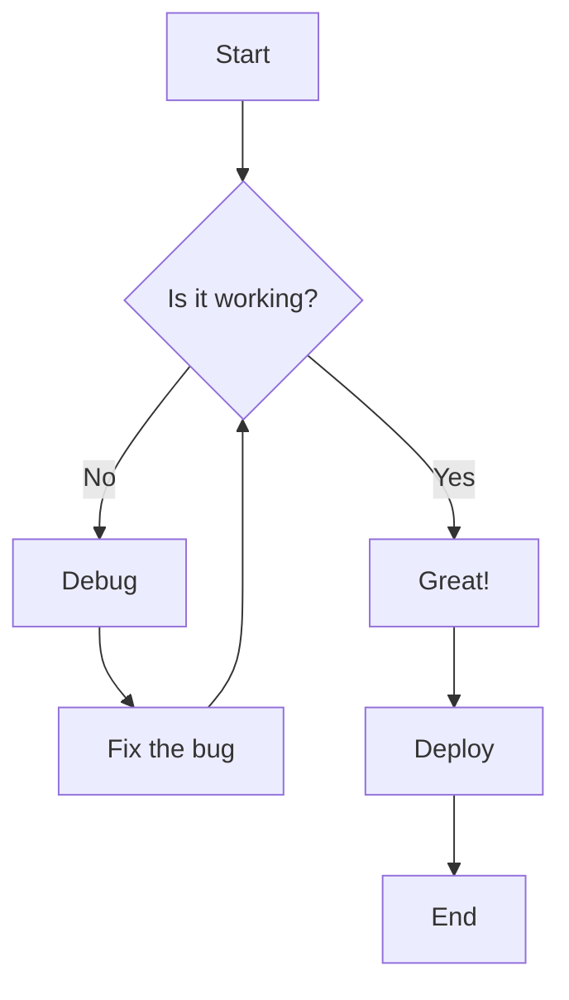
```mermaid
flowchart TB
    A[Start] --> B{Is it working?}
    B -->|Yes| C[Great!]
    B -->|No| D[Debug]
    D --> E[Fix the bug]
    E --> B
    C --> F[Deploy]
    F --> G[End]
```

### Flowchart (Left to Right)

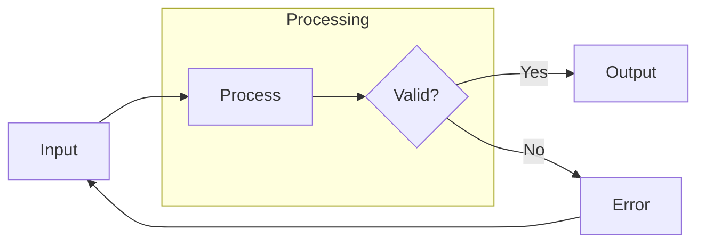
```mermaid
flowchart LR
    A[Input] --> B[Process]
    B --> C{Valid?}
    C -->|Yes| D[Output]
    C -->|No| E[Error]
    E --> A

    subgraph Processing
        B
        C
    end
```

### Sequence Diagram

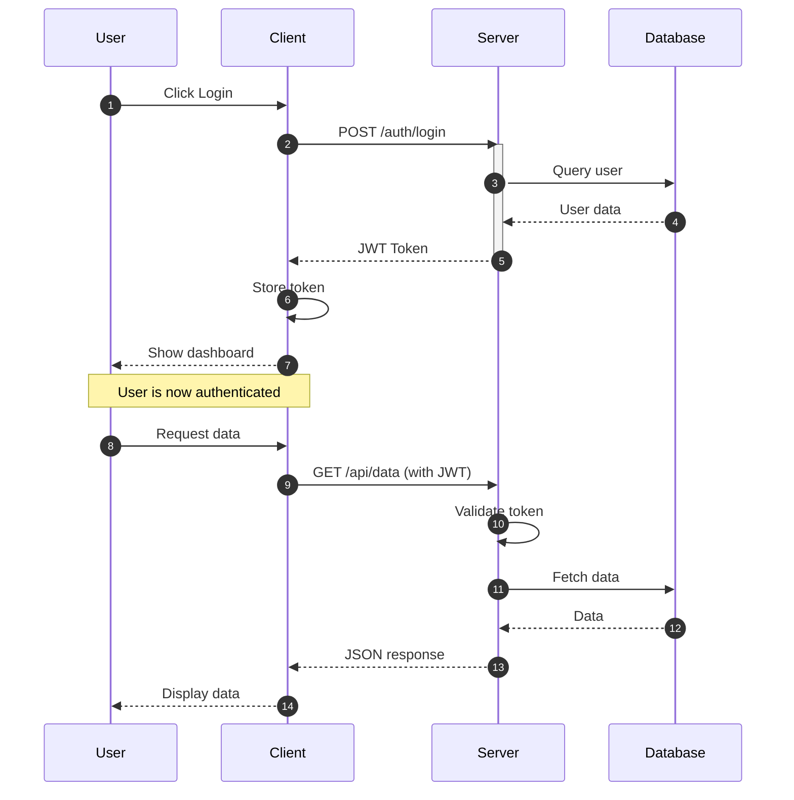
```mermaid
sequenceDiagram
    autonumber
    participant U as User
    participant C as Client
    participant S as Server
    participant D as Database

    U->>C: Click Login
    C->>S: POST /auth/login
    activate S
    S->>D: Query user
    D-->>S: User data
    S-->>C: JWT Token
    deactivate S
    C->>C: Store token
    C-->>U: Show dashboard

    Note over U,C: User is now authenticated

    U->>C: Request data
    C->>S: GET /api/data (with JWT)
    S->>S: Validate token
    S->>D: Fetch data
    D-->>S: Data
    S-->>C: JSON response
    C-->>U: Display data
```

### Class Diagram

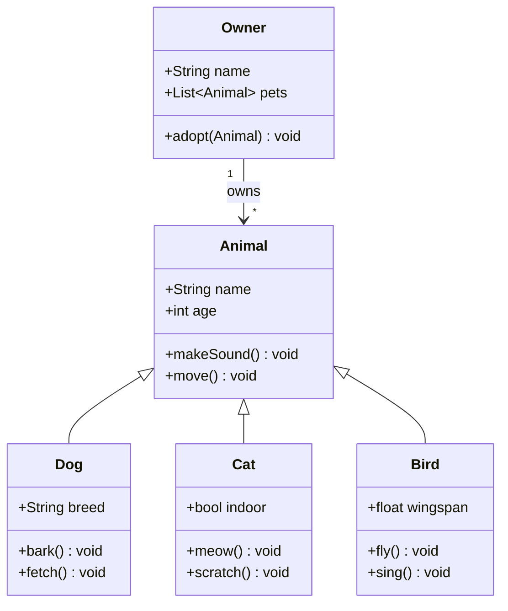
```mermaid
classDiagram
    class Animal {
        +String name
        +int age
        +makeSound() void
        +move() void
    }

    class Dog {
        +String breed
        +bark() void
        +fetch() void
    }

    class Cat {
        +bool indoor
        +meow() void
        +scratch() void
    }

    class Bird {
        +float wingspan
        +fly() void
        +sing() void
    }

    Animal <|-- Dog
    Animal <|-- Cat
    Animal <|-- Bird

    class Owner {
        +String name
        +List~Animal~ pets
        +adopt(Animal) void
    }

    Owner "1" --> "*" Animal : owns
```

### State Diagram

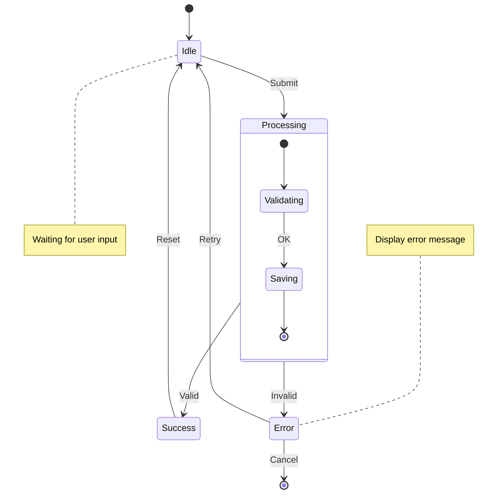
```mermaid
stateDiagram-v2
    [*] --> Idle

    Idle --> Processing : Submit
    Processing --> Success : Valid
    Processing --> Error : Invalid

    Success --> Idle : Reset
    Error --> Idle : Retry
    Error --> [*] : Cancel

    state Processing {
        [*] --> Validating
        Validating --> Saving : OK
        Saving --> [*]
    }

    note right of Idle : Waiting for user input
    note left of Error : Display error message
```

### Entity Relationship Diagram

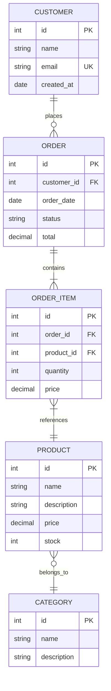
```mermaid
erDiagram
    CUSTOMER ||--o{ ORDER : places
    CUSTOMER {
        int id PK
        string name
        string email UK
        date created_at
    }

    ORDER ||--|{ ORDER_ITEM : contains
    ORDER {
        int id PK
        int customer_id FK
        date order_date
        string status
        decimal total
    }

    ORDER_ITEM }|--|| PRODUCT : references
    ORDER_ITEM {
        int id PK
        int order_id FK
        int product_id FK
        int quantity
        decimal price
    }

    PRODUCT {
        int id PK
        string name
        string description
        decimal price
        int stock
    }

    PRODUCT }o--|| CATEGORY : belongs_to
    CATEGORY {
        int id PK
        string name
        string description
    }
```

### Gantt Chart

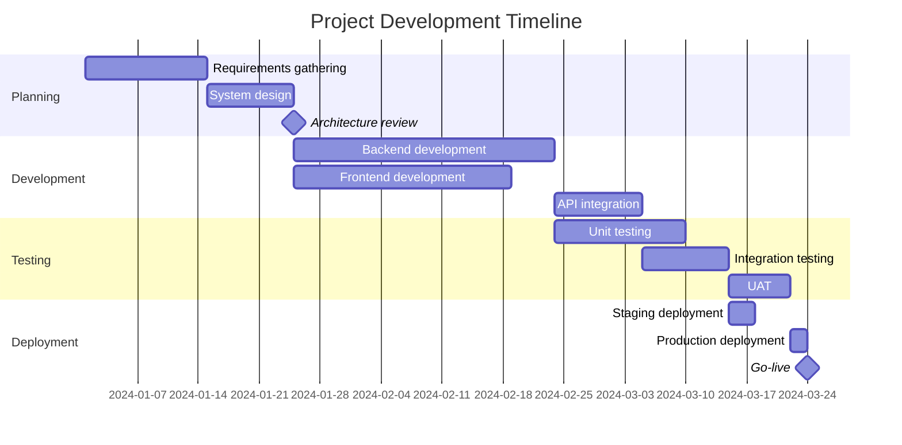
```mermaid
gantt
    title Project Development Timeline
    dateFormat  YYYY-MM-DD

    section Planning
    Requirements gathering    :a1, 2024-01-01, 14d
    System design            :a2, after a1, 10d
    Architecture review      :milestone, m1, after a2, 0d

    section Development
    Backend development      :b1, after a2, 30d
    Frontend development     :b2, after a2, 25d
    API integration          :b3, after b1, 10d

    section Testing
    Unit testing            :c1, after b1, 15d
    Integration testing     :c2, after b3, 10d
    UAT                     :c3, after c2, 7d

    section Deployment
    Staging deployment      :d1, after c2, 3d
    Production deployment   :d2, after c3, 2d
    Go-live                 :milestone, m2, after d2, 0d
```

### Pie Chart

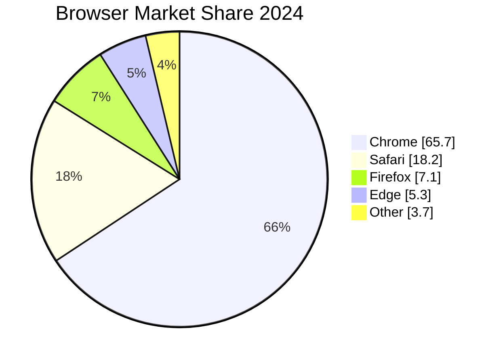
```mermaid
pie showData
    title Browser Market Share 2024
    "Chrome" : 65.7
    "Safari" : 18.2
    "Firefox" : 7.1
    "Edge" : 5.3
    "Other" : 3.7
```

### Git Graph

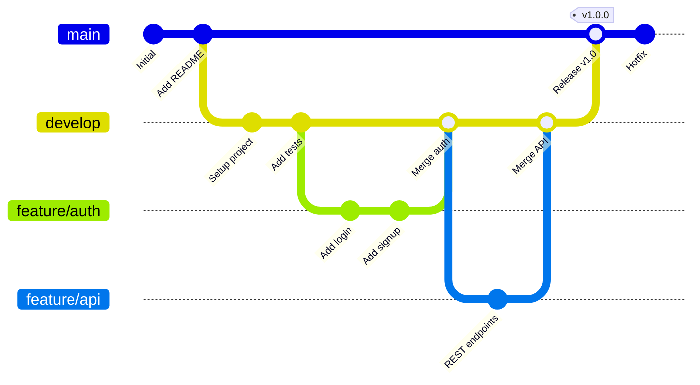
```mermaid
gitGraph
    commit id: "Initial"
    commit id: "Add README"
    branch develop
    checkout develop
    commit id: "Setup project"
    commit id: "Add tests"
    branch feature/auth
    checkout feature/auth
    commit id: "Add login"
    commit id: "Add signup"
    checkout develop
    merge feature/auth id: "Merge auth"
    branch feature/api
    checkout feature/api
    commit id: "REST endpoints"
    checkout develop
    merge feature/api id: "Merge API"
    checkout main
    merge develop id: "Release v1.0" tag: "v1.0.0"
    commit id: "Hotfix"
```

### User Journey

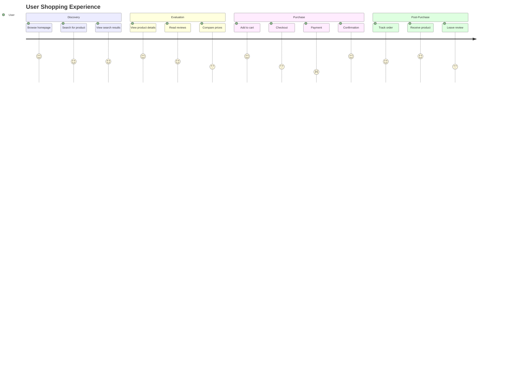
```mermaid
journey
    title User Shopping Experience
    section Discovery
      Browse homepage: 5: User
      Search for product: 4: User
      View search results: 4: User
    section Evaluation
      View product details: 5: User
      Read reviews: 4: User
      Compare prices: 3: User
    section Purchase
      Add to cart: 5: User
      Checkout: 3: User
      Payment: 2: User
      Confirmation: 5: User
    section Post-Purchase
      Track order: 4: User
      Receive product: 5: User
      Leave review: 3: User
```

### Mindmap

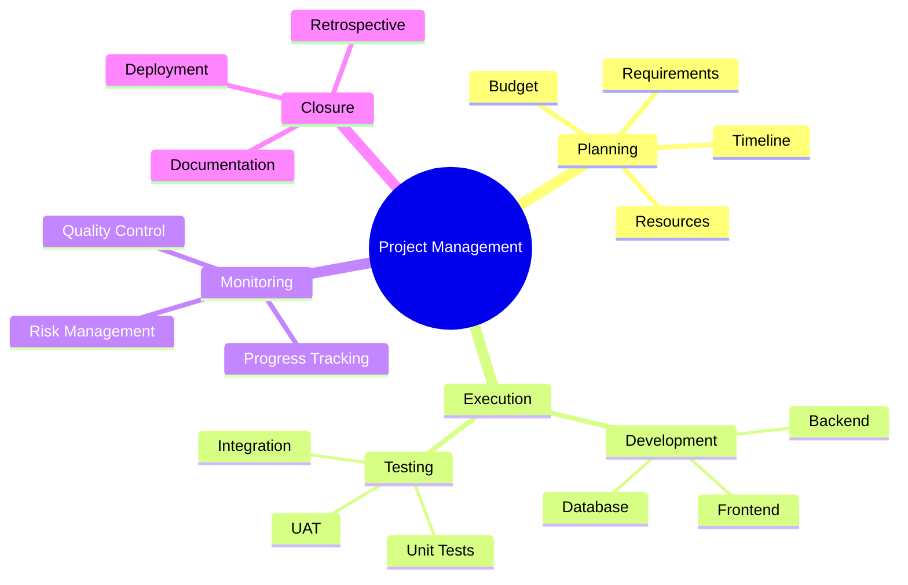
```mermaid
mindmap
  root((Project Management))
    Planning
      Requirements
      Timeline
      Resources
      Budget
    Execution
      Development
        Frontend
        Backend
        Database
      Testing
        Unit Tests
        Integration
        UAT
    Monitoring
      Progress Tracking
      Risk Management
      Quality Control
    Closure
      Documentation
      Deployment
      Retrospective
```

### Timeline

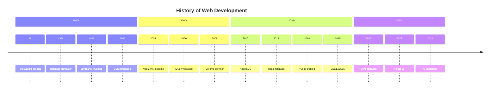
```mermaid
timeline
    title History of Web Development
    section 1990s
        1991 : First website created
        1994 : Netscape Navigator
        1995 : JavaScript invented
        1996 : CSS introduced
    section 2000s
        2004 : Web 2.0 era begins
        2006 : jQuery released
        2008 : Chrome browser
    section 2010s
        2010 : AngularJS
        2013 : React released
        2014 : Vue.js created
        2015 : ES6/ES2015
    section 2020s
        2020 : Deno released
        2022 : React 18
        2023 : AI integration
```

### Quadrant Chart

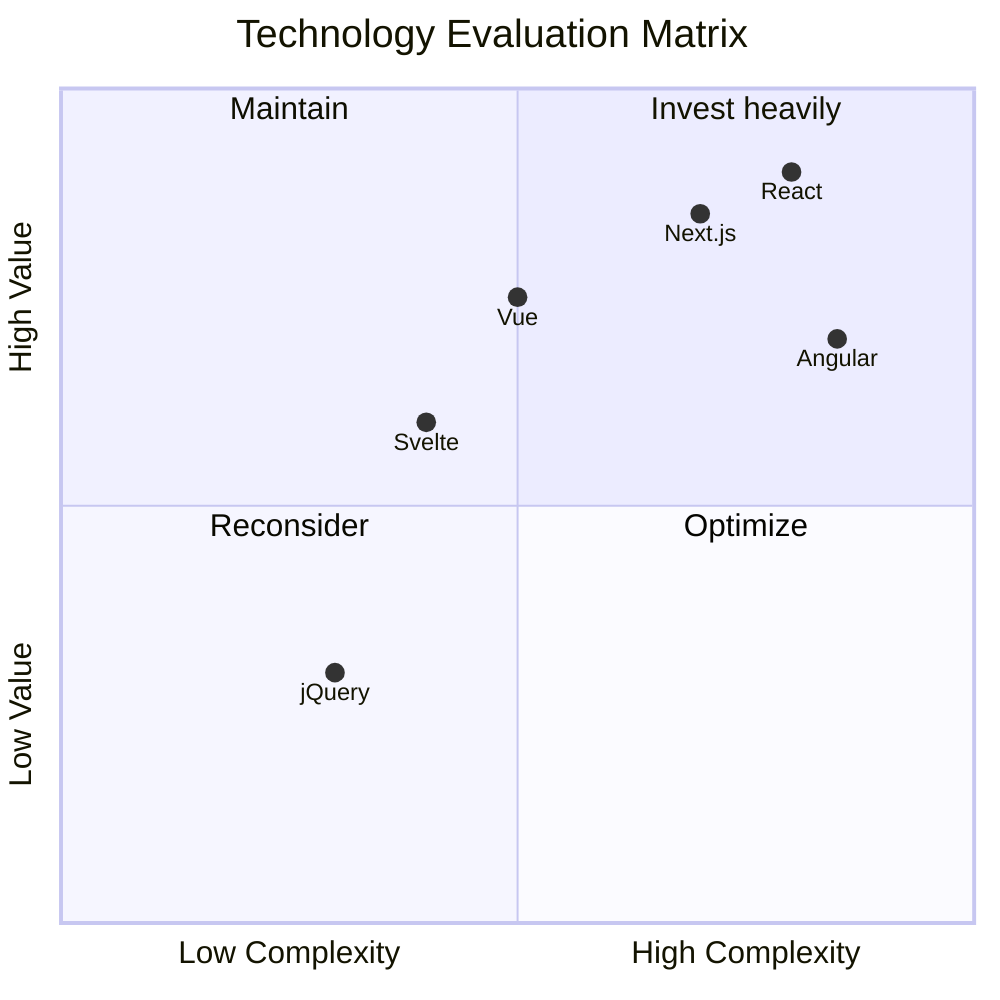
```mermaid
quadrantChart
    title Technology Evaluation Matrix
    x-axis Low Complexity --> High Complexity
    y-axis Low Value --> High Value
    quadrant-1 Invest heavily
    quadrant-2 Maintain
    quadrant-3 Reconsider
    quadrant-4 Optimize
    React: [0.8, 0.9]
    Vue: [0.5, 0.75]
    Angular: [0.85, 0.7]
    jQuery: [0.3, 0.3]
    Svelte: [0.4, 0.6]
    Next.js: [0.7, 0.85]
```

### Requirement Diagram

```mermaid
requirementDiagram
    requirement user_auth {
        id: REQ-001
        text: System shall authenticate users
        risk: high
        verifymethod: test
    }

    requirement password_policy {
        id: REQ-002
        text: Passwords must be 8+ characters
        risk: medium
        verifymethod: inspection
    }

    element auth_module {
        type: module
    }

    element password_validator {
        type: function
    }

    auth_module - satisfies -> user_auth
    password_validator - satisfies -> password_policy
    user_auth - contains -> password_policy
```

### C4 Diagram (Context)

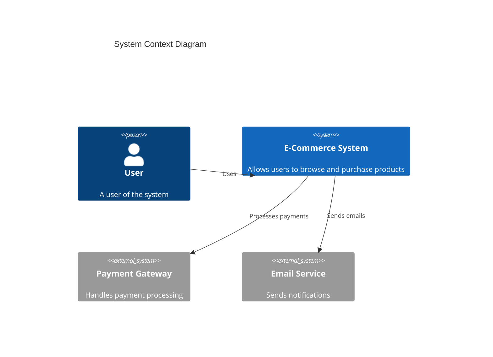
```mermaid
C4Context
    title System Context Diagram

    Person(user, "User", "A user of the system")
    System(system, "E-Commerce System", "Allows users to browse and purchase products")
    System_Ext(payment, "Payment Gateway", "Handles payment processing")
    System_Ext(email, "Email Service", "Sends notifications")

    Rel(user, system, "Uses")
    Rel(system, payment, "Processes payments")
    Rel(system, email, "Sends emails")
```

### XY Chart

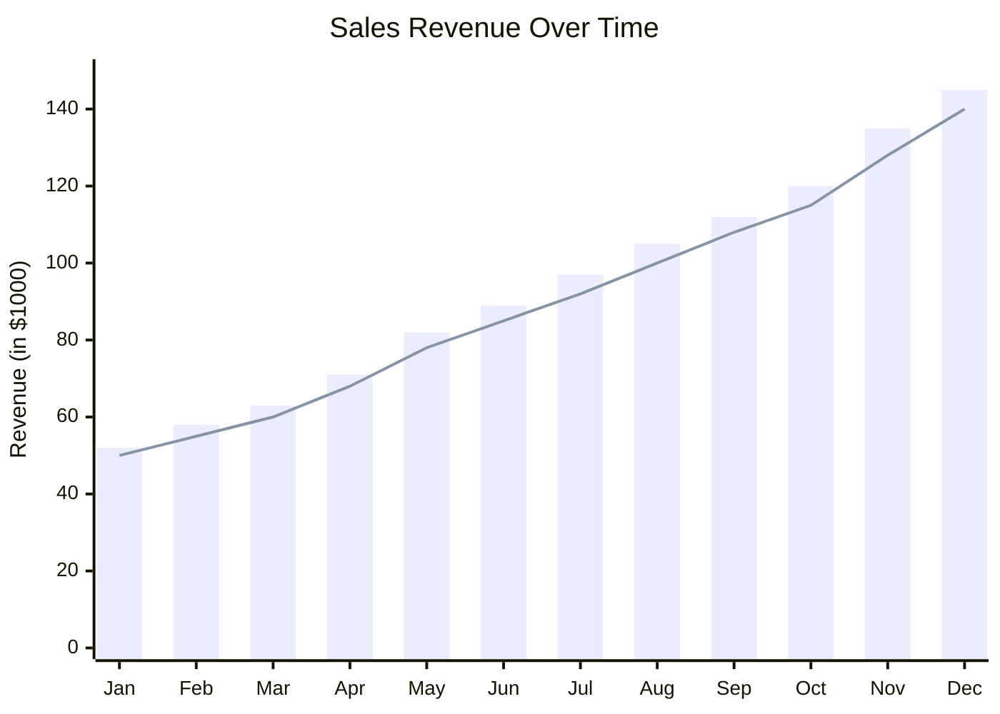
```mermaid
xychart-beta
    title "Sales Revenue Over Time"
    x-axis [Jan, Feb, Mar, Apr, May, Jun, Jul, Aug, Sep, Oct, Nov, Dec]
    y-axis "Revenue (in $1000)" 0 --> 150
    bar [52, 58, 63, 71, 82, 89, 97, 105, 112, 120, 135, 145]
    line [50, 55, 60, 68, 78, 85, 92, 100, 108, 115, 128, 140]
```

### Block Diagram

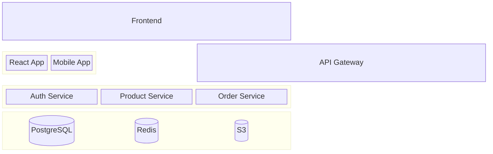
```mermaid
block-beta
    columns 3

    Frontend:3
    block:client
        A["React App"]
        B["Mobile App"]
    end

    space

    API["API Gateway"]:3

    block:services:3
        C["Auth Service"]
        D["Product Service"]
        E["Order Service"]
    end

    block:data:3
        F[("PostgreSQL")]
        G[("Redis")]
        H[("S3")]
    end
```

### Sankey Diagram

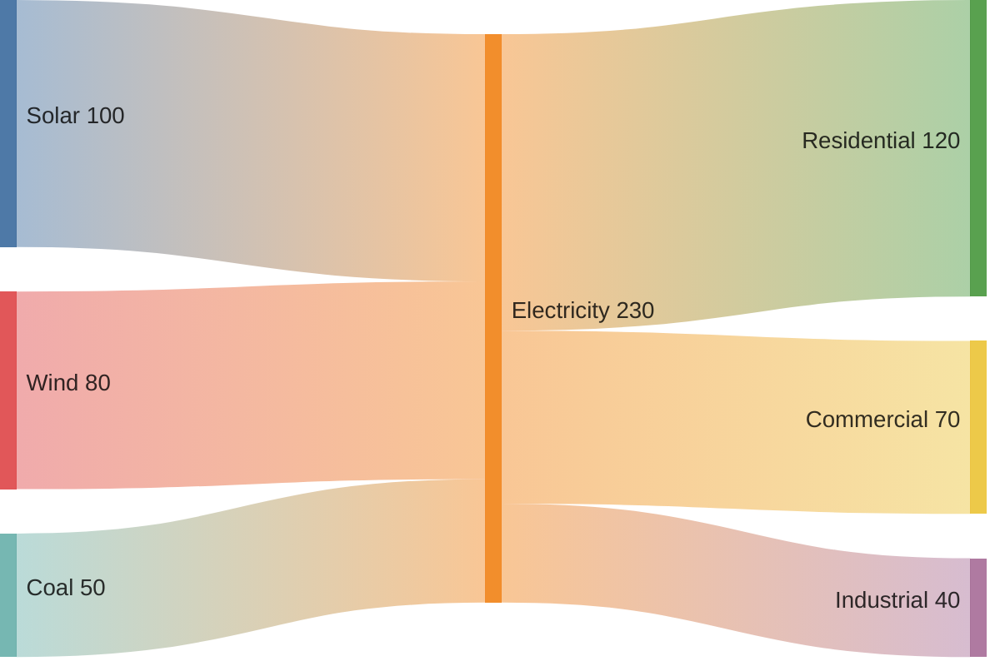
```mermaid
sankey-beta
    %% Energy flow diagram
    Solar,Electricity,100
    Wind,Electricity,80
    Coal,Electricity,50
    Electricity,Residential,120
    Electricity,Commercial,70
    Electricity,Industrial,40
```

---

## Miscellaneous

### Horizontal Rules

Three hyphens:

---

Three asterisks:

---

Three underscores:

---

### Footnotes

Here's a sentence with a footnote.[^1]

Another sentence with a different footnote.[^2]

Here's one with a longer identifier.[^bignote]

[^1]: This is the first footnote.

[^2]: This is the second footnote.

[^bignote]: This is a longer footnote with multiple paragraphs.

    Indent paragraphs to include them in the footnote.

    `{ code }` can be included too.

### Abbreviations (if supported)

The HTML specification is maintained by the W3C.

_[HTML]: Hyper Text Markup Language
_[W3C]: World Wide Web Consortium

### Keyboard Keys (HTML)

Press <kbd>Ctrl</kbd> + <kbd>C</kbd> to copy.

Press <kbd>Cmd</kbd> + <kbd>Shift</kbd> + <kbd>P</kbd> to open command palette.

### Details/Summary (Collapsible)

<details>
<summary>Click to expand!</summary>

This is hidden content that appears when you click the summary.

- Item 1
- Item 2
- Item 3

```python
print("Hidden code!")
```

</details>

<details open>
<summary>This is open by default</summary>

This content is visible by default but can be collapsed.

</details>

### Comments (Not Rendered)

[//]: # "This is a comment and won't be rendered"

<!-- HTML comment style -->

### Escape Characters

\*Not italic\*

\*\*Not bold\*\*

\# Not a header

\[Not a link\]

\`Not code\`

### Emojis (if supported)

:smile: :heart: :thumbsup: :rocket: :star: :fire: :tada:

Unicode emojis: 😀 ❤️ 👍 🚀 ⭐ 🔥 🎉

### Special Characters

Copyright: © | Registered: ® | Trademark: ™

Arrows: → ← ↑ ↓ ↔ ⇒ ⇐

Math symbols: ± × ÷ ≠ ≈ ≤ ≥ ∞ ∑ ∏ √

Currency: $ € £ ¥ ₹ ₿

### Anchor Links

<a name="custom-anchor"></a>

[Jump to custom anchor](#custom-anchor)

[Jump to top](#markdown-rendering-test-document)

### Raw HTML Block

<div style="background: linear-gradient(to right, #667eea, #764ba2); padding: 20px; border-radius: 10px; color: white;">
    <h3 style="margin: 0;">Custom HTML Block</h3>
    <p>This is a custom styled div using raw HTML.</p>
    <button onclick="alert('Hello!')">Click me</button>
</div>

### Embedded Video (HTML)

<video width="320" height="240" controls>
    <source src="movie.mp4" type="video/mp4">
    Your browser does not support the video tag.
</video>

### iFrame Embed

<iframe width="560" height="315" src="https://www.youtube.com/embed/dQw4w9WgXcQ" frameborder="0" allowfullscreen></iframe>

### Audio Embed

<audio controls>
    <source src="audio.mp3" type="audio/mpeg">
    Your browser does not support the audio element.
</audio>

### Progress Bar (HTML)

<progress value="70" max="100">70%</progress>

### Meter (HTML)

<meter value="0.7" min="0" max="1">70%</meter>

### Color Input Display

<input type="color" value="#3498db"> Primary Color
<input type="color" value="#2ecc71"> Secondary Color

---

## End of Test Document

This document covers all major markdown features including:

- ✅ Headers (H1-H6)
- ✅ Text formatting (bold, italic, strikethrough, etc.)
- ✅ Lists (ordered, unordered, nested, task lists)
- ✅ Links and images
- ✅ Code blocks (15+ languages)
- ✅ **Comprehensive Math/LaTeX (40+ edge cases)**
  - Inline math (subscripts, superscripts, fractions, fonts, accents, vectors, braces, colors)
  - Display environments (align, gather, multline, split, cases, array)
  - All matrix types (pmatrix, bmatrix, vmatrix, Vmatrix, Bmatrix, smallmatrix)
  - Delimiter sizing (auto and manual: \big, \Big, \bigg, \Bigg)
  - Advanced symbols (logic, set theory, calculus, physics)
  - Edge cases (phantom, smash, boxed, custom tags, colors, nested delimiters)
  - Physics equations (Maxwell, Schrödinger, Einstein field equations)
- ✅ Tables (basic and complex)
- ✅ Blockquotes (nested)
- ✅ Mermaid diagrams (15+ types)
- ✅ Footnotes (including with math)
- ✅ HTML elements
- ✅ Keyboard keys
- ✅ Collapsible sections
- ✅ Special characters and emojis
- ✅ And more!

---

_Document generated for comprehensive markdown rendering testing purposes._
