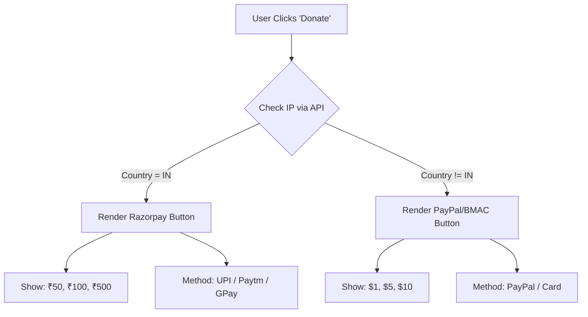

# Design Document: Geo-Adaptive Donation System
## Functional Requirements & Strategy

**Document ID:** DD-2025-003-DONATION
**Author:** Sr. Principal SDE
**Status:** Draft
**Date:** 2025-12-19

---

## 1. Problem Statement

The goal is to enable a simplified donation ("Buy Me a Coffee") flow that maximizes conversion rates by offering **local payment methods** and **native pricing** based on the user's location, specifically targeting:
*   **India:** Needs UPI support (GooglePay, PhonePe) and INR pricing (e.g., ₹50, ₹100). International cards often fail here due to RBI mandates.
*   **Global (ROW):** Needs PayPal/Stripe support and USD pricing (e.g., $1, $5).
*   **Contexts:** Must be accessible from the Web Application and static contexts like GitHub `README.md`.

---

## 2. Requirements

### 2.1 Functional Requirements (FR)

| ID | Requirement | Description |
|---|---|---|
| **FR-1** | **IP Geolocation** | System must detect if the user is in India (IN) or Rest of World (ROW). |
| **FR-2** | **Dynamic Currency** | Display INR (₹) presets for IN users and USD ($) presets for ROW users. |
| **FR-3** | **Preset Tiers** | **INR:** ₹50, ₹100, ₹250, ₹500, Custom.<br>**USD:** $1, $5, $10, $20, Custom. |
| **FR-4** | **Payment Method** | **IN:** Redirect to UPI/Razorpay.<br>**ROW:** Redirect to PayPal/Stripe/BMAC. |
| **FR-5** | **Readme Compatibility** | Since `README.md` cannot run JS, it must link to a hosted "Donation Routing Page" that handles the logic. |

### 2.2 Non-Functional Requirements (NFR)

| ID | Requirement | Description |
|---|---|---|
| **NFR-1** | **Zero Setup Cost** | Solution must not incur monthly fees (Transaction fees only). |
| **NFR-2** | **Legal Compliance** | **India:** Must comply with Tax laws (Income classification).<br>**Global:** Must avoid FCRA triggers (if applicable to individuals, usually treated as "Export of Services" or "Gift"). |
| **NFR-3** | **Performance** | Geo-lookup must add < 500ms latency to the donation page load. |
| **NFR-4** | **Privacy** | Do not store PII during the routing phase. |

---

## 3. Compliance & Financial Viability

### 3.1 The "Two-Pocket" Strategy
To follow online donation laws strictly without complex business registration:
1.  **Pocket A (India):** Use **Razorpay** or **UPI Payment Link**.
    *   *Why:* Indian Payment Gateways require KYC and Indian Bank Accounts. They handle domestic UPI/Netbanking perfectly.
    *   *Compliance:* Treated as Domestic Income.
2.  **Pocket B (International):** Use **PayPal** or **Buy Me a Coffee (Stripe)**.
    *   *Why:* PayPal is the standard for cross-border small payments. Razorpay International often has high failure rates for personal accounts.
    *   *Compliance:* Treated as Foreign Inward Remittance (FIRC provided by PayPal/Bank).

---

## 4. Solution Options & Trade-offs

### Option A: dedicated "Buy Me a Coffee" (Single Platform)
Use a single platform like *Buy Me a Coffee* (BMAC) or *Ko-fi*.
*   **Pros:** Zero dev effort, hosted page, handles currency conversion automatically (shows local currency to user usually).
*   **Cons:**
    *   **High Fees:** BMAC takes ~5% cut + Stripe fees.
    *   **UPI Failure:** Often fails to present a native UPI intent flow for Indians, leading to drop-offs.
    *   **Conversion:** Indian users seeing $5 (approx ₹400) might hesitate compared to seeing a native ₹100 tier.

### Option B: The "Smart Router" (Recommended)
Create a simple custom landing page (e.g., `markdown-viewer.com/donate`) that detects IP and shows the right button.

*   **Pros:**
    *   **Perfect UX:** Indians see UPI + ₹50. Global users see PayPal + $3.
    *   **Lower Fees:** Razorpay (Domestic) is ~2%, PayPal is ~4-5%. No extra platform reliability fee.
    *   **Control:** Full control over presets.
*   **Cons:** Requires hosting a simple HTML page (Free via GitHub Pages/Vercel).

---

## 5. Implementation Plan (The "Smart Router")

### 5.1 Architecture
1.  **Static Badge (README/Footer):**
    *   Image: `Donate ☕`
    *   Link: `https://your-site.vercel.app/donate`
2.  **Routing Page (`/donate`):**
    *   **Tech:** Static HTML + Client-side JS.
    *   **Geo-Service:** Use `https://ipapi.co/json/` (Free tier: 1000 requests/day) or Cloudflare Traces (Unlimited).

### 5.2 Flow Logic


### 5.3 Financial Setup (Free)
1.  **For India (INR):**
    *   Sign up for **Razorpay Payment Pages** (No coding needed).
    *   Create a page "Buy me a Coffee".
    *   Set Fixed Amounts: ₹50, ₹100 (or "Decide yourself" field).
    *   *Cost:* 0 setup, ~2% per transaction.
2.  **For Global (USD):**
    *   Sign up for **PayPal.Me** or **Ko-fi** (connects to PayPal).
    *   Ko-fi is better (0% platform fee on donations, only PayPal fees).
    *   *Cost:* 0 setup, ~4-5% per transaction.

---

## 6. Final Recommendation

**Go with Option B (Smart Router) hosted on GitHub Pages.**

*   **Why?** It is technically robust, legally safest (clean separation of domestic vs international funds), and offers the best user experience.
*   **Cost:** $0.
*   **Effort:** ~1 hour to write the HTML/JS for the landing page.

### Sample Code Snippet (Concept)
```javascript
async function renderDonationOptions() {
  const response = await fetch('https://ipapi.co/json/');
  const data = await response.json();

  if (data.country_code === 'IN') {
    // Show Razorpay UI
    document.getElementById('currency').innerText = 'INR';
    document.getElementById('presets').innerHTML =
      '<button>₹50</button><button>₹100</button>';
    document.getElementById('payment-link').href = 'https://rzp.io/l/your-link';
  } else {
    // Show PayPal/Ko-fi UI
    document.getElementById('currency').innerText = 'USD';
    document.getElementById('presets').innerHTML =
      '<button>$1</button><button>$5</button>';
    document.getElementById('payment-link').href = 'https://ko-fi.com/your-id';
  }
}
```
