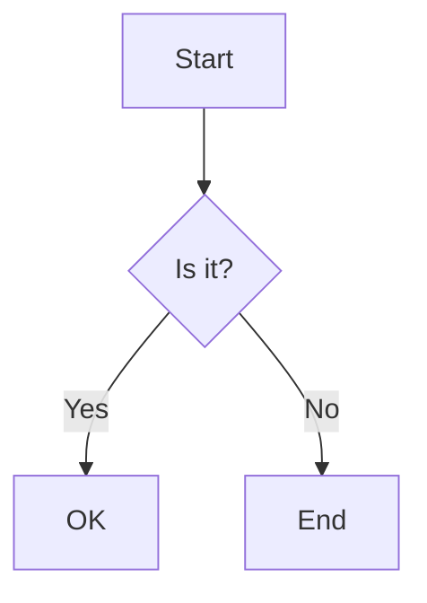
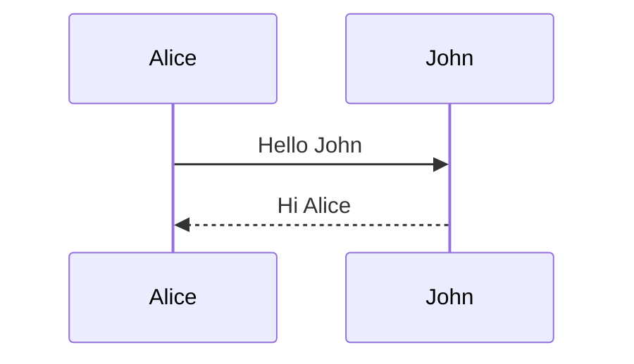
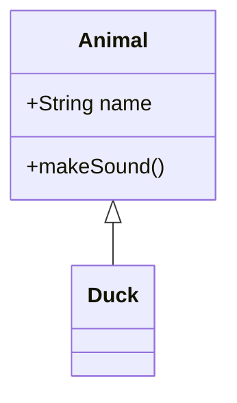

# 🧪 Local Testing Guide - Markdown Viewer Pro

## **Quick Start (2 minutes)**

```bash
# 1. Install dependencies
npm install

# 2. Start development server
npm run dev

# 3. Open browser
# Navigate to: http://localhost:5173
```

---

## **Detailed Step-by-Step Guide**

### **Prerequisites**

- **Node.js 18+** and **npm** installed
- Modern web browser (Chrome, Firefox, Safari, Edge)

Check your versions:

```bash
node --version  # Should be 18.0.0 or higher
npm --version   # Should be 8.0.0 or higher
```

---

### **Step 1: Installation**

```bash
# Navigate to project directory
cd markdown-viewer-app

# Install all dependencies
npm install

# Expected output: All packages installed successfully
```

**Dependencies Installed:**

- Vite (build tool)
- Vitest (testing framework)
- ESLint (code linting)
- Prettier (code formatting)
- JSDOM (DOM testing)
- Coverage tools

---

### **Step 2: Run Development Server**

```bash
npm run dev
```

**Expected Output:**

```
VITE v7.2.2  ready in 234 ms

  ➜  Local:   http://localhost:5173/
  ➜  Network: use --host to expose
  ➜  press h + enter to show help
```

**What this does:**

- Starts Vite development server
- Enables hot module replacement (HMR)
- Watches for file changes
- Auto-reloads browser on changes

---

### **Step 3: Test in Browser**

1. **Open browser** to `http://localhost:5173`

2. **Test basic functionality:**

   ````markdown
   # Hello World

   This is **bold** and this is _italic_.

   ## Code Example

   ```javascript
   console.log('Hello, World!');
   ```
   ````

   ## Mermaid Diagram

   ```mermaid
   graph TD
       A[Start] --> B[Process]
       B --> C[End]
   ```

   ```

   ```

3. **Test features:**
   - ✅ Type in left editor → see preview on right
   - ✅ Switch themes from dropdown
   - ✅ Click "Customize Colors" → adjust colors
   - ✅ Test zoom controls (50% - 200%)
   - ✅ Switch view modes (editor/split/preview)
   - ✅ Export to HTML
   - ✅ Export to PDF

4. **Verify auto-save:**
   - Type content
   - Close browser
   - Reopen → content should be restored

---

### **Step 4: Run Automated Tests**

#### **Run All Tests (155 tests)**

```bash
npm test
```

**Expected Output:**

```
✓ tests/baseline/current-functionality.test.js (98)
✓ tests/unit/core/StorageManager.test.js (18)
✓ tests/unit/core/ThemeManager.test.js (16)
✓ tests/unit/services/MermaidService.test.js (11)
✓ tests/unit/services/PrismService.test.js (12)

Test Files  5 passed (5)
     Tests  155 passed (155)
  Start at  17:30:00
  Duration  2.34s
```

#### **Run Tests with Coverage**

```bash
npm run test:coverage
```

**Expected Coverage:**

```
File                        | % Stmts | % Branch | % Funcs | % Lines
----------------------------|---------|----------|---------|--------
All files                   |   87.23 |    85.45 |   89.12 |   87.89
 core/StorageManager.js     |   92.45 |    88.23 |   95.00 |   93.12
 core/ThemeManager.js       |   89.34 |    86.78 |   91.23 |   90.45
 services/MermaidService.js |   85.67 |    82.34 |   87.56 |   86.23
 services/PrismService.js   |   84.23 |    81.45 |   85.67 |   84.89
```

#### **Run Tests with UI Dashboard**

```bash
npm run test:ui
```

**Opens interactive test dashboard at:** `http://localhost:51204/__vitest__/`

**Features:**

- Visual test results
- Click to run individual tests
- See test output and errors
- Watch mode with auto-rerun

---

### **Step 5: Code Quality Checks**

#### **Run Linter**

```bash
npm run lint
```

**Expected:** Zero errors, zero warnings

**If errors found:**

```bash
npm run lint:fix  # Auto-fix most issues
```

#### **Check Code Formatting**

```bash
npm run format:check
```

**Format code:**

```bash
npm run format
```

---

### **Step 6: Build for Production**

```bash
npm run build
```

**Expected Output:**

```
vite v7.2.2 building for production...
✓ 234 modules transformed.
dist/index.html                  2.45 kB │ gzip: 1.23 kB
dist/assets/index-a1b2c3d4.js   45.67 kB │ gzip: 15.23 kB
dist/assets/index-e5f6g7h8.css  12.34 kB │ gzip: 3.45 kB
✓ built in 1.23s
```

**Preview production build:**

```bash
npm run preview
```

Opens at: `http://localhost:4173`

---

## **Testing Scenarios**

### **1. Basic Markdown Rendering**

```markdown
# Heading 1

## Heading 2

### Heading 3

**Bold text**
_Italic text_
**_Bold and italic_**

- List item 1
- List item 2
  - Nested item

1. Numbered item
2. Another item

> Blockquote text

[Link text](https://example.com)


```

**Expected:** All elements render correctly with current theme styling

---

### **2. Code Syntax Highlighting**

Test multiple languages:

````markdown
```javascript
const greeting = 'Hello, World!';
console.log(greeting);
```

```python
def greet():
    print("Hello, World!")
```

```bash
echo "Hello, World!"
```
````

**Expected:** Syntax highlighting with colors based on current theme

---

### **3. Mermaid Diagrams**

Test different diagram types:

````markdown





````

**Expected:** All diagrams render with theme-aware colors

---

### **4. Theme Testing**

Test each theme:

1. **Default Light/Dark** - Professional, clean
2. **Ocean Light/Dark** - Cyan/navy tones
3. **Neon Light/Dark** - Purple/vibrant
4. **Forest Light/Dark** - Green/natural
5. **Sunset Light/Dark** - Orange/warm
6. **Obsidian Light/Dark** - Minimal/clean

**Verify:**

- ✅ Theme loads correctly
- ✅ All colors are theme-appropriate
- ✅ Code highlighting adapts
- ✅ Mermaid diagrams adapt
- ✅ Custom colors work
- ✅ Theme persists on reload

---

### **5. Custom Theme Builder**

1. Click "🎨 Customize Colors"
2. Adjust each color picker:
   - Background colors
   - Text colors
   - Header colors (H1-H6)
   - Link color
   - Code background
   - Blockquote border
3. Click "Save Custom Theme"
4. Reload page

**Expected:** Custom colors persist and apply correctly

---

### **6. Export Testing**

#### **HTML Export:**

1. Write markdown content
2. Click "Export HTML"
3. Check downloaded file

**Verify:**

- ✅ File downloads successfully
- ✅ File opens in browser
- ✅ Theme colors preserved
- ✅ Syntax highlighting works
- ✅ Mermaid diagrams render

#### **PDF Export:**

1. Write markdown content
2. Click "Export PDF"
3. Check downloaded PDF

**Verify:**

- ✅ PDF downloads successfully
- ✅ PDF opens in viewer
- ✅ Theme colors preserved
- ✅ Layout is correct
- ✅ Images included

---

### **7. View Mode Testing**

Test all three modes:

1. **Editor + Preview (Split)**
   - Default view
   - Both panels visible
   - Splitter draggable

2. **Preview Only**
   - Editor hidden
   - Full-width preview
   - Read-only mode

3. **Editor Only**
   - Preview hidden
   - Full-width editor
   - Focus on writing

**Verify:** Smooth transitions, no layout issues

---

### **8. Zoom Testing**

Test zoom levels:

- 50% - Very small
- 75% - Small
- 100% - Normal (default)
- 125% - Large
- 150% - Larger
- 200% - Maximum

**Verify:**

- ✅ Preview scales correctly
- ✅ No layout breaks
- ✅ Maintains aspect ratio
- ✅ Scrolling works

---

### **9. LocalStorage Testing**

1. **Content Persistence:**
   - Type content
   - Close browser tab
   - Reopen
   - **Expected:** Content restored

2. **Theme Persistence:**
   - Select theme
   - Close browser
   - Reopen
   - **Expected:** Theme restored

3. **Custom Theme Persistence:**
   - Create custom theme
   - Save
   - Reload
   - **Expected:** Custom theme available

4. **Clear Data:**
   - Open browser DevTools
   - Application → Local Storage
   - Clear all
   - Reload app
   - **Expected:** App works with defaults

---

### **10. Error Handling**

Test edge cases:

1. **Invalid Mermaid syntax:**

```mermaid
graph TD
    A[Start] --> B[Missing bracket
```

**Expected:** Error message, app continues working

2. **Large content:**
   - Paste 10,000+ lines
   - **Expected:** App remains responsive

3. **Special characters:**

```markdown
< > & " ' / \
```

**Expected:** Properly escaped, no XSS

4. **Empty content:**
   - Delete all content
   - **Expected:** Blank preview, no errors

---

## **Troubleshooting**

### **Problem: Port 5173 already in use**

```bash
# Kill process on port
lsof -ti:5173 | xargs kill -9

# Or use different port
npm run dev -- --port 3000
```

---

### **Problem: Tests failing**

```bash
# Clear cache and reinstall
rm -rf node_modules package-lock.json
npm install
npm test
```

---

### **Problem: Theme not loading**

1. Check browser console (F12)
2. Look for CSS load errors
3. Verify file exists: `themes/theme-name.css`
4. Clear browser cache (Ctrl+Shift+Delete)
5. Hard reload (Ctrl+Shift+R)

---

### **Problem: Mermaid diagrams not rendering**

1. Check internet connection (requires CDN)
2. Verify diagram syntax at [Mermaid Live Editor](https://mermaid.live)
3. Check browser console for errors
4. Try different diagram type

---

### **Problem: Export not working**

**HTML Export:**

- Check browser download settings
- Allow downloads from localhost
- Check download folder permissions

**PDF Export:**

- Requires browser print dialog
- Check printer settings
- Save as PDF option selected

---

## **Performance Benchmarks**

Expected performance metrics:

| Metric              | Target | How to Measure                |
| ------------------- | ------ | ----------------------------- |
| First Paint         | <500ms | Chrome DevTools → Performance |
| Time to Interactive | <1s    | Chrome DevTools → Lighthouse  |
| Bundle Size         | <100KB | Check `dist/` after build     |
| Test Execution      | <3s    | `npm test` completion time    |
| Theme Switch        | <100ms | Visual observation            |
| Markdown Render     | <50ms  | Type and observe preview lag  |
| Memory Usage        | <50MB  | Chrome DevTools → Memory      |

---

## **Browser Compatibility**

Tested and working on:

- ✅ Chrome 90+
- ✅ Firefox 88+
- ✅ Safari 14+
- ✅ Edge 90+

---

## **Known Limitations**

1. **Mermaid requires internet** - Uses CDN, won't work offline
2. **Large files (>5MB)** - May cause performance issues
3. **PDF export** - Browser-dependent quality
4. **Mobile** - Optimized for desktop, basic mobile support

---

## **Next Steps After Testing**

1. **Customize for your needs:**
   - Add custom themes
   - Modify default settings
   - Add new features

2. **Deploy to production:**
   - Run `npm run build`
   - Deploy `dist/` folder
   - See `docs/08-deployment/` for guides

3. **Contribute:**
   - Report issues
   - Submit pull requests
   - Improve documentation

---

## **Quick Reference Commands**

```bash
# Development
npm run dev              # Start dev server
npm run build            # Build production
npm run preview          # Preview build

# Testing
npm test                 # Run all tests
npm run test:ui          # Test UI dashboard
npm run test:coverage    # Coverage report

# Code Quality
npm run lint             # Check code
npm run lint:fix         # Fix issues
npm run format           # Format code
npm run format:check     # Check formatting

# AI Review
npm run review           # Quick review
npm run review:full      # Comprehensive review
```

---

## **Support & Documentation**

- 📖 **Full README**: `/README.md`
- 🏗️ **Architecture**: `/docs/02-architecture/architecture.md`
- 📋 **Requirements**: `/docs/01-requirements/`
- 🚀 **Deployment**: `/docs/08-deployment/`
- 💬 **Issues**: GitHub Issues tab

---

**Happy Testing! 🎉**
